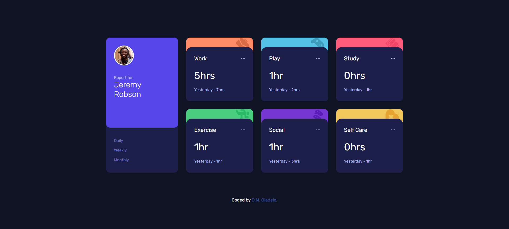

## Table of contents

- [Overview](#overview)
  - [The challenge](#the-challenge)
  - [Screenshot](#screenshot)
  - [Links](#links)
- [My process](#my-process)
  - [Built with](#built-with)
  - [What I learned](#what-i-learned)
  - [Continued development](#continued-development)
  - [Useful resources](#useful-resources)
- [Author](#author)

## Overview

### The challenge

Users should be able to:

- View the optimal layout for the site depending on their device's screen size
- See hover states for all interactive elements on the page
- Switch between viewing Daily, Weekly, and Monthly stats

### Screenshot

### Links
- Solution URL: [Add solution URL here](https://your-solution-url.com)
- Live Site URL: [Add live site URL here](https://your-live-site-url.com)

## My process

### Built with
- Semantic HTML5 markup
- CSS custom properties
- CSS Grid
- JavaScript Vanilla

### What I learned
- Was able to practice the use of grid for layout for the first time.
- Was able to implment Object Oriented Programming for my javaScript

### Continued development
- Need to continue learning and practice with grid especially learning the grid area.
- Improve on implementation of Object Oriented programming

### Useful resources
- [MDN](https://developer.mozilla.org/en-US/docs/Web/CSS/CSS_Grid_Layout) - This helped me WITH CSS Grid Layout

## Author
- Blog - [D.M. Oladele](https://activuscode.hashnode.dev/)
- Twitter - [@activus_d](https://twitter.com/activus_d)
